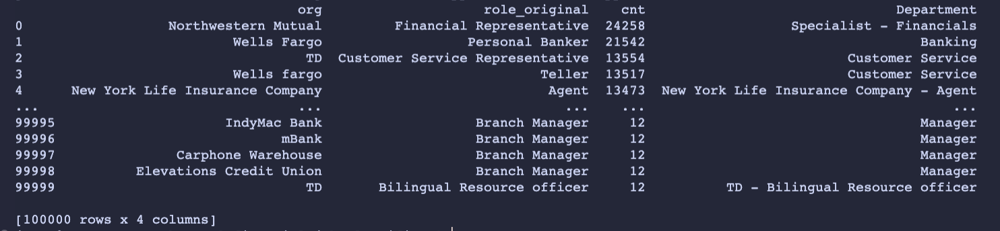

# Financial Job Classifier

> Given a txt file of job titles from various financial firms, what is an optimal categorization of job titles for data preparation? Moreover, can this process be written as a classifier function?

## (1) Job Categorization - Strategy

From the given dataset, I analyzed patterns with how specific financial firms would label job titles. For example, Bank of America alone has 2483 distinct job titles with niche titles such as _"Compliance Testing Analyst"_ and _"Market Credit Officer"_.

For some firms, there are very general roles such as _"Associate"_, or _"Intern"_, which skew a potential classifier's accuracy in assigning specific departments (i.e. _"Customer Service Intern"_ roles may be mistakenly assigned as general _"Intern"_ roles).

In general, I wanted to group job titles by their specific service within the firm, so for bankers, I grouped them under _"Banking"_, and _"Mortgage Consultant"_ positions under _"Specialist - Loans & Credit"_, since a mortgage is a type of loan. Below is a snapshot of these categories:

| Category                          | Job Titles                                                                              |
| --------------------------------- | --------------------------------------------------------------------------------------- |
| "Banking"                         | "Banker", "Personal Banker", "Relationship Banker", "Universal Banker", "Retail Banker" |
| "Specialist - Loans & Credit"     | "Home Mortgage Consultant", "Mortgage Consultant", "Loan Officer", "Credit Manager"     |
| "Specialist - Investment Banking" | "Investment Banking Analyst", "Investment Banking Summer Analyst"                       |

### Edge cases

If a firm listed a general job title as part of their listings, such as _"Associate"_ or _"Intern"_, those were grouped separately under _"General"_ since the classifier would have trouble specifying which department they would be associated with. (i.e. _"Associate"_ could be "Customer Service Associate" or _"Investment Banking Associate"_).

| Category  | Job Titles                     |
| --------- | ------------------------------ |
| "General" | "Associate", "Intern", "Agent" |

The firms in this dataset also included traditionally non-financial positions, such as _"Software Engineer"_ or _"Barista"_ (from Starbucks), so those titles were grouped in separate categories for _"Tech"_ and _"Food Services"_, respectively.

## (2) Classifier - Brainstorm

A general classifier function for this dataset would theoretically be able to group job titles based on if the key value in the `job-categories.json` file was included anywhere within the job title. So, for example, a _"Financial Representative Intern"_ would be grouped under _"Specialist - Financials"_ since _"Financial Representative"_ was included in the job title.

In `classfier.py`, I implemented a simple 'Classifier' class with a `classify_into_groups` method which takes in data (input col and output), and returns the data with the added `category` column if `role_original` is included in the array for the assiciated category. The `Classifier` class is shown below:

```py
class Classifier:
    def __init__(self, dictionary):
        self._dict = dictionary

    def classify_into_groups(self, data, input_col, output_col_name="Category"):
        def assign_category(row):
            for category, titles in self._dict.items():
                if row[input_col] in titles:
                    return category
            return f"{row['org']} - {row[input_col]}"

        data[output_col_name] = data.apply(assign_category, axis=1)
        return data
```

An example output is shown below:



### Potential issues

As stated before in (1)("Edge Cases"), the classfier may run into issues with grouping _"General"_ roles with specific departments. Thus, my solution to this issue would be to assign each _"General"_ role with `<org> - <job title>` (i.e. an _"Intern"_ at _"Bank of America"_ would be classified as _"Bank of America - Intern"_). This is done to differentiate between _"General"_ roles between firms, since different firms may label these roles differently from each other.

Given the large number of specific job titles in the dataset, the same strategy would be applied to specific job titles not found in the `job-categories.json` file, yet the pattern would instead be `<org> - Misc`, indicating a miscellaneous role. Further classifier methods can also be applied to this _"Misc"_ category for more clarity, but in terms of this large dataset, it should be able to assign a department to every job title listed as shown below:

| org               | role_original | Department                 | Related Job Titles             |
| ----------------- | ------------- | -------------------------- | ------------------------------ |
| "Bank of America" | "Intern"      | "Bank of America - Intern" | "Associate", "Intern", "Agent" |

## Final Thoughts

Clearly, my categorization and classfier approach leaves much room for improvement, such as considering more edge cases or separating _"Corporate"_ roles to more specific departments, for example. However, this method provides a decent base for grouping job listings in various financial firms based on similar services or role.
